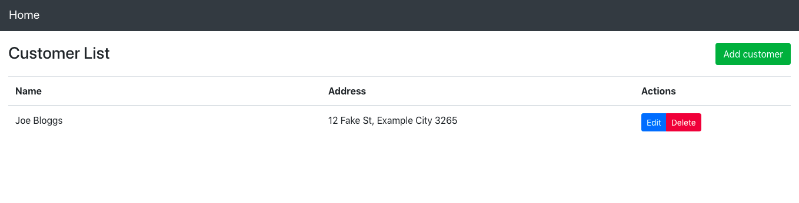

## Spring Boot API with ReactJS UI 
A Spring RESTful web service that CRUD data via ReactJS UI.

**Requirements** 
Java 
Node.js

**Getting Started**  
After cloning this repo,

To run the server, in Spring directory run
> ./mvnw spring-boot:run

To run the client, in reactjs directory run
> npm start

Navigate to localhost:3000
Should see

Clicking on the link

